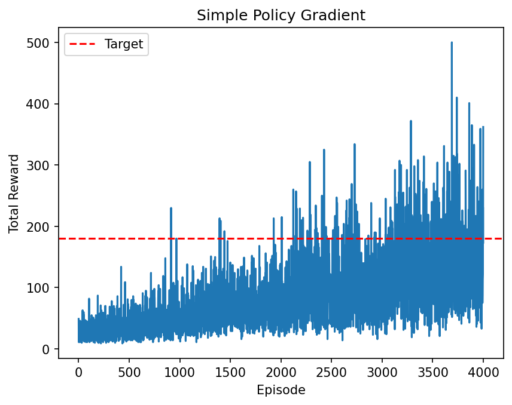
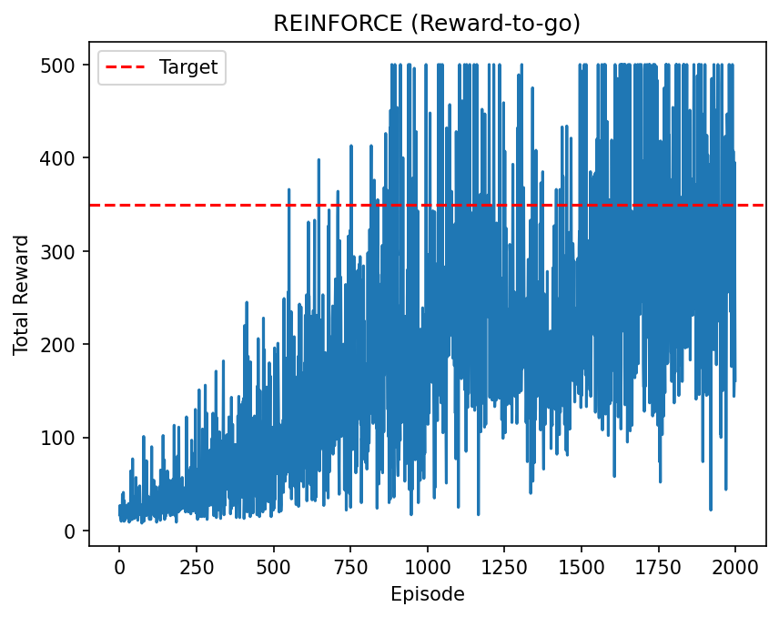

# 강화학습 과제 5주차

발제자: 조재관

이 과제는 **Simple PG와 REINFORCE를 비교**하는 내용입니다.  
`simple_pg.py`, `reinforcement.py`를 실행하고 결과를 분석합니다.

### 제출 기한

**2월 16일 (월) 11시 59분**까지

---

## Simple PG vs REINFORCE (CartPole-v1)

대상 파일: `simple_pg.py`, `reinforcement.py`

### 구현/작성할 것 (TODO)

- 각 파일의 TODO가 표시된 부분만 작성합니다.
- `reinforcement.py` 하단의 **질문 1, 2 답변**을 작성합니다.

### 학습 결과 조건

- `simple_pg.py`: 최고 Total Reward **120 이상**
- `reinforcement.py`: 최고 Total Reward **350 이상**

그래프에서 기준치를 넘는 구간이 보이도록 학습 결과를 확인합니다.  
두 그래프 모두 기준선을 **빨간 점선**으로 표시하며, 실행 시 자동 저장됩니다.

### 실행

```bash
python reinforcement.py
python simple_pg.py
```

---

## 제출 방법

1. TODO 부분 작성 (`reinforcement.py` 질문 답변 포함)
2. 두 코드 실행
3. 결과 그래프 이미지를 Week5 폴더에 저장(저장 코드 구현돼 있음)
   (예: `simple_pg.png`, `reinforce.png`)
4. 기준 Reward 충족 여부 확인

---

## 예시 결과 이미지





---

## 실행 환경 세팅

### 가상환경 활성화(venv, conda 자유)

(예시)

```bash
python -m venv .venv
source .venv/bin/activate
```

### 필수 패키지 설치

Week5 폴더 안의 `requirements.txt`를 사용해서 설치합니다.

```bash
# Week5 폴더에서 실행
pip install -r requirements.txt
```

이미 다른 버전이 설치되어 있어서 에러가 나는 경우 아래처럼 다시 설치합니다.

```bash
# Week5 폴더에서 실행
pip uninstall -y numpy gym gymnasium
pip install -r requirements.txt
```

### gymnasium 사용

최신 환경을 위해 `gymnasium`을 사용하며, `CartPole-v1`과 최신 step API를 기준으로 작성되어 있습니다.

### CartPole v0 vs v1 차이

- `v0`: 에피소드 최대 길이 200
- `v1`: 에피소드 최대 길이 500 (더 오래 버텨야 해서 초기 학습이 더 어렵게 느껴질 수 있음)

## 참고 자료

- 밑시딥4권 chapter9
